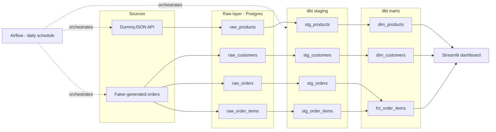

# E-Commerce ELT Pipeline

An end-to-end data engineering pipeline that extracts e-commerce product and order data, loads it into Postgres, transforms it into a dimensional model with dbt, orchestrates the whole flow with Airflow, and serves the results through a live Streamlit dashboard — all containerized with Docker.

## Why this project

Most portfolio pipelines stop at "pull an API into a database." This one goes further: it models the data into a proper star schema, tests data quality and referential integrity at every layer, and runs on a schedule against data that changes over time — closer to how a real analytics team's stack behaves than a one-off script.

## Architecture



## Stack

| Layer | Tool | Why |
|---|---|---|
| Extraction | Python (requests, Faker) | Pagination, retries, and synthetic order generation |
| Storage | PostgreSQL | Raw (bronze) and modeled (analytics) schemas |
| Transformation | dbt | Staging → marts, with 22 automated data quality tests |
| Orchestration | Airflow | Daily DAG with retries and task dependencies |
| Dashboard | Streamlit | Live KPIs and charts read directly from the marts |
| Containerization | Docker Compose | One command spins up the entire stack |

## Data model

Star schema at the order-item grain — the most granular reasonable level, so everything else (daily revenue, orders per customer, category performance) aggregates up from it rather than being locked in by an earlier, coarser design.

- **`dim_products`** — one row per product, with a computed `discounted_price`
- **`dim_customers`** — one row per customer
- **`fct_order_items`** — one row per line item, joined to order status and date, with a `net_line_total` that excludes cancelled orders

## Running it

```bash
git clone <your-repo-url>
cd ecommerce-pipeline
cp .env.example .env
docker compose up -d --build
```

Then:
- **Airflow UI:** http://localhost:8080 — admin password is printed in `docker compose logs airflow` (search for `password:`)
- **Dashboard:** http://localhost:8501 — will show an error until the first DAG run completes; the DAG starts unpaused and runs automatically within about a minute

To trigger a run manually:
```bash
docker compose exec airflow airflow dags trigger ecommerce_elt_pipeline
```

To run dbt directly, outside the DAG:
```bash
docker compose run --rm dbt run
docker compose run --rm dbt test
```

## Data quality

22 dbt tests across staging and marts: uniqueness and not-null constraints on every primary key, plus relationship tests verifying every order item traces back to a real order, customer, and product. Run `docker compose run --rm dbt test` to see them execute.

## Notable bugs and fixes (why this wasn't a straight-line build)

- **JSONB silently stored as text** — a bare SQLAlchemy type class (`JSONB`) instead of an instance (`JSONB()`) caused pandas to fall back to text inference; dbt's `jsonb`-only `->>` operator caught the mismatch at build time.
- **Non-idempotent primary keys** — `order_item_id` was a per-run counter starting at 1, causing duplicate keys on every second pipeline run. Fixed by deriving the next ID from `MAX(id)` in the existing table.
- **Drop-and-recreate broke downstream views** — once dbt built a view on top of `raw_products`, the extraction script's `if_exists="replace"` pattern (a `DROP TABLE`) started failing because Postgres won't drop a table with dependent views. Switched to truncate-and-load, the correct pattern for a full-refresh source with dependents.

## Known simplifications (and what production would use instead)

- **Airflow `standalone` mode** (SQLite metadata DB, single process) instead of the Postgres + CeleryExecutor setup a production deployment would use for parallelism and durability.
- **Full-refresh staging models** instead of incremental dbt models — fine at this data volume, but would need `is_incremental()` logic at real scale.
- **No secrets manager** — credentials are handled via `.env` / `env_var()`, appropriate for a local project; production would use something like AWS Secrets Manager or Vault.

## Project structure
├── docker-compose.yml
├── Dockerfile.dbt
├── Dockerfile.airflow
├── Dockerfile.streamlit
├── extract/
│ ├── extract_products.py
│ └── generate_orders.py
├── dbt_project/
│ ├── models/staging/
│ ├── models/marts/
│ └── profiles.yml
├── dags/
│ └── ecommerce_pipeline_dag.py
└── dashboard/
└── app.py